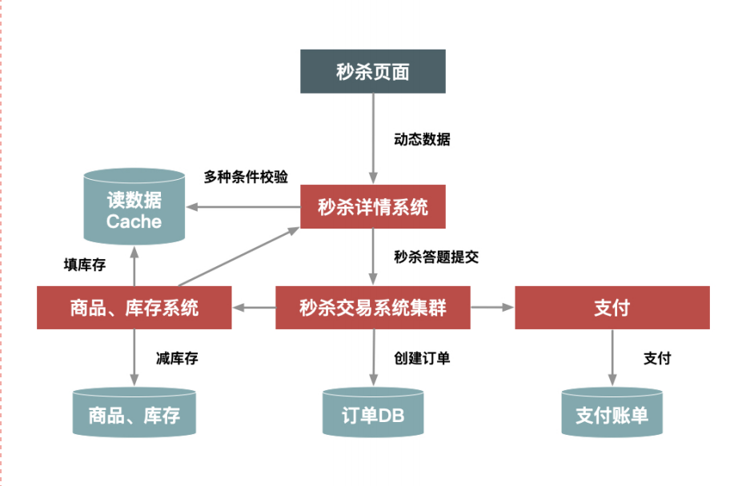
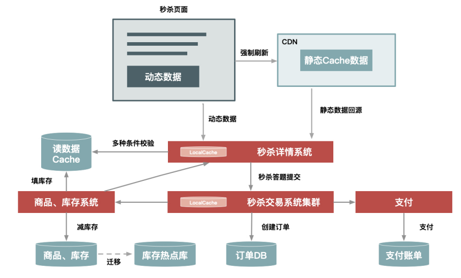
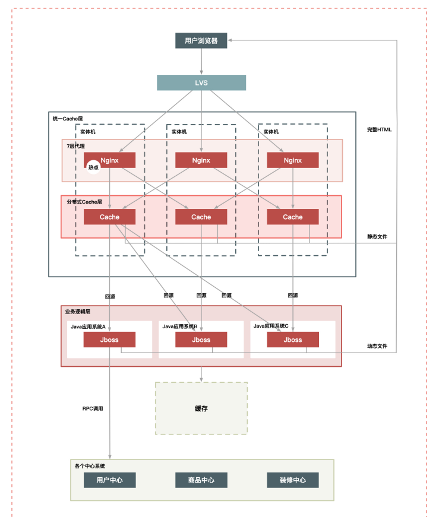
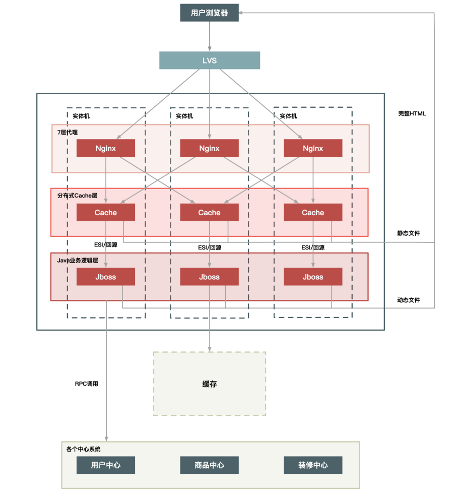
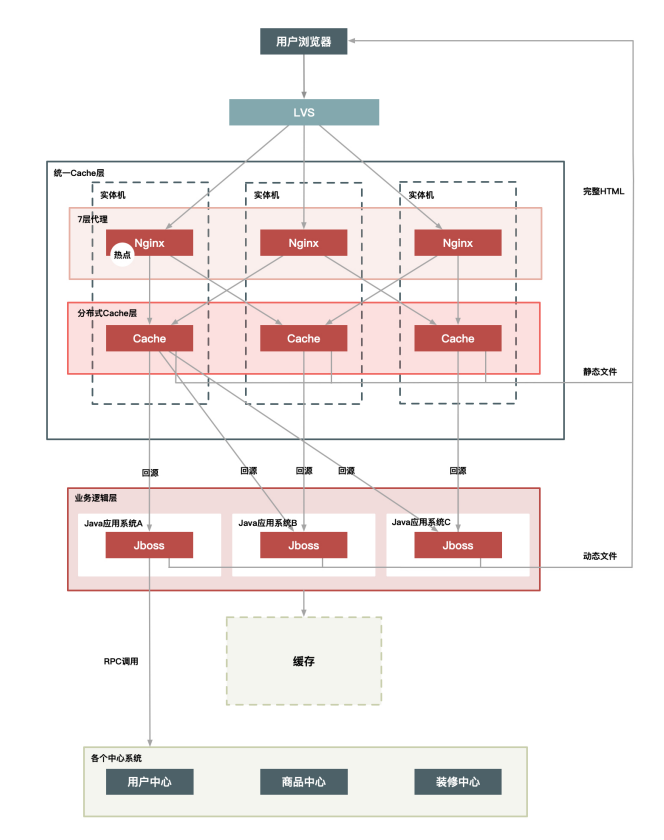
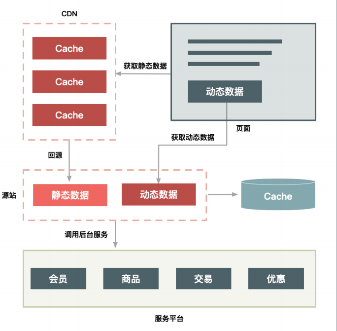

# seckill分布式秒杀系统

#### 介绍
可插拔式秒杀/限时抢购系统

1. 微服务架构下的高并发使用场景（seata-AT、seata-TCC、全局事务、mq事务消息）
2. 限时商品上架（elastic-job）
3. 高并发环境下的优化手段（redis缓存、mq、限流）
4. 支付环境：支付宝沙箱、积分支付、退款、退积分
5. 数据库与redis缓存的一致性（canal）
6. 异步下单（websocket监测下单结果，延迟消息队列）

#### 核心技术栈
springcloudalibaba、redis、rocketmq、canal、wobsocket、elastic-job、zookeeper

#### 秒杀架构设计
1. 秒杀系统架构设计都有哪些关键点？
    1. **高性能**。 秒杀涉及大量的并发读和并发写，因此支持高并发访问这点非常关键。
    2. **一致性**。 秒杀中商品减库存的实现方式同样关键。可想而知，有限数量的商品在同一时刻被很多倍的请求同时来减库存，减库存又分为“拍下减库存”“付款减库存”以及预扣等种，在大并发更新的过程中都要保证数据的准确性，其难度可想而知。
    3. **高可用**。 虽然有很多极致的优化思路，但现实中总难免出现一些我们考虑不到的情况，所以要保证系统的高可用和正确性，我们还要设计一个 PlanB 来兜底，以便在最坏情况发生时仍然能够从容应对。

2. 设计秒杀系统时应该注意的5个架构原则
    1. **数据要尽量少**。所谓“数据要尽量少”，首先是指用户请求的数据能少就少。请求的数据包括上传给系统的数据和系统返回给用户的数据（通常就是网页）。
    2. **请求数要尽量少**。
    3. **路径要尽量短**。所谓“路径”，就是用户发出请求到返回数据这个过程中，需求经过的中间的节点数。
    4. **依赖要尽量少**。所谓依赖，指的是要完成一次用户请求必须依赖的系统或者服务，这里的依赖指的是强依赖。
    5. **不要有单点**。系统中的单点可以说是系统架构上的一个大忌，因为单点意味着没有备份，风险不可控，**我们设计分布式系统最重要的原则就是“消除单点”**。

3. 不同场景下的秒杀架构
    1. 如果你想快速搭建一个简单的秒杀系统，只需要把你的商品购买页面增加一个“定时上架”功能，仅在秒杀开始时才让用户看到购买按钮，当商品的库存卖完了也就结束了。这就是当时第一个版本的秒杀系统实现方式。
    
    2. 然而这个架构仍然支持不了超过 100w/s 的请求量，所以为了进一步提升秒杀系统的性能，我们又对架构做进一步升级，比如：
        对页面进行彻底的动静分离，使得用户秒杀时不需要刷新整个页面，而只需要点击抢宝按钮，借此把页面刷新的数据降到最少；
        在服务端对秒杀商品进行本地缓存，不需要再调用依赖系统的后台服务获取数据，甚至不需要去公共的缓存集群中查询数据，这样不仅可以减少系统调用，而且能够避免压垮公共缓存集群。
        增加系统限流保护，防止最坏情况发生。
     
    3. 从前面的几次升级来看，其实越到后面需要定制的地方越多，也就是越“不通
用”。例如，把秒杀商品缓存在每台机器的内存中，这种方式显然不适合太多的商品同时进行秒杀的情况，因为单机的内存始终有限。所以要取得极致的性能，就要在其他地方（比如，通用性、易用性、成本等方面）有所牺牲。

4. 如何才能做好动静分离？有哪些方案可选？
    那到底什么才是动静分离呢？所谓“动静分离”，其实就是把用户请求的数据（如 HTML 页面）划分为“动态数据”和“静态数据”。
    简单来说，“动态数据”和“静态数据”的主要区别就是看页面中输出的数据是否和 URL、浏览者、时间、地域相关，以及是否含有 Cookie 等私密数据。比如说：
        1. 很多媒体类的网站，某一篇文章的内容不管是你访问还是我访问，它都是一样的。所以它就是一个典型的静态数据，但是它是个动态页面。
        2. 我们如果现在访问淘宝的首页，每个人看到的页面可能都是不一样的，淘宝首页中包含了很多根据访问者特征推荐的信息，而这些个性化的数据就可以理解为动态数据了。
    这里再强调一下，我们所说的静态数据，不能仅仅理解为传统意义上完全存在磁盘上的 HTML 页面，它也可能是经过 Java 系统产生的页面，但是它输出的页面本身不包含上面所说的那些因素。也就是所谓“动态”还是“静态”，并不是说数据本身是否动静，而是数据中是否含有和访问者相关的个性化数据。
    
    1. 那么，怎样对静态数据做缓存呢？我在这里总结了几个重点。
        第一，你应该把静态数据缓存到离用户最近的地方。静态数据就是那些相对不会变化的数据，因此我们可以把它们缓存起来。缓存到哪里呢？常见的就三种，用户浏览器里、CDN 上或者在服务端的 Cache 中。你应该根据情况，把它们尽量缓存到离用户最近的地方。
        第二，静态化改造就是要直接缓存 HTTP 连接。相较于普通的数据缓存而言，你肯定还听过系统的静态化改造。静态化改造是直接缓存 HTTP 连接而不是仅仅缓存数据，如下图所示，Web 代理服务器根据请求 URL，直接取出对应的HTTP 响应头和响应体然后直接返回，这个响应过程简单得连 HTTP 协议都不用重新组装，甚至连 HTTP 请求头也不需要解析.
        
        第三，让谁来缓存静态数据也很重要。不同语言写的 Cache 软件处理缓存数据的效率也各不相同。以 Java 为例，因为 Java 系统本身也有其弱点（比如不擅长处理大量连接请求，每个连接消耗的内存较多，Servlet 容器解析 HTTP 协议较慢），所以你可以不在 Java 层做缓存，而是直接在 Web 服务器层上做，这样你就可以屏蔽 Java 语言层面的一些弱点；而相比起来，Web 服务器（如 Nginx、Apache、Varnish）也更擅长处理大并发的静态文件请求。

    2. 前面我们介绍里用缓存的方式来处理静态数据。而动态内容的处理通常有两种方案：ESI（Edge Side Includes）方案和 CSI（Client Side Include）方案。
        1. ESI 方案（或者 SSI）：即在 Web 代理服务器上做动态内容请求，并将请求插入到静态页面中，当用户拿到页面时已经是一个完整的页面了。这种方式对服务端性能有些影响，但是用户体验较好。
        2. CSI 方案。即单独发起一个异步 JavaScript 请求，以向服务端获取动态内容。这种方式服务端性能更佳，但是用户端页面可能会延时，体验稍差。
    
    3. 动静分离的几种架构方案.
        1. 实体机单机部署；
        
        2. 统一 Cache 层；
        
        3. 上 CDN。
        


#### 项目入口
[项目入口](http://localhost)

#### 项目截图


#### 模块介绍
1. frontend-server         前端模块
2. api-gateway             网关模块
3. canal-client            canal客户端模块
4. shop-common             通用模块
5. shop-uaa                用户模块
6. websocket-server        wocket服务端模块
7. intergral-server        积分模块
8. job-server              定时任务模块
9. pay-server              支付模块
10. product-server         商品模块
11. seckill-server         秒杀模块

#### 代码结构
```
+---api-gateway
|   |   api-gateway.iml
|   |   pom.xml
|   |
|   +---src
|   |   \---main
|   |       +---java
|   |       |   \---cn
|   |       |       \---wolfcode
|   |       |           |   ApiGatewayApplication.java
|   |       |           |
|   |       |           +---config
|   |       |           |       CorsConfig.java
|   |       |           |       GatewayConfiguration.java
|   |       |           |
|   |       |           \---filters
|   |       |                   CommonFilter.java
|   |       |
|   |       \---resources
|   |               bootstrap.yml
|   |
+---canal-client
|   |   canal-client.iml
|   |   pom.xml
|   |
|   +---src
|   |   \---main
|   |       +---java
|   |       |   \---cn
|   |       |       \---wolfcode
|   |       |           |   CanalClientApp.java
|   |       |           |
|   |       |           \---handler
|   |       |                   OrderaInfoHandler.java
|   |       |
|   |       \---resources
|   |               bootstrap.yml
|   |
+---shop-common
|   |   pom.xml
|   |
|   +---src
|   |   \---main
|   |       \---java
|   |           \---cn
|   |               \---wolfcode
|   |                   +---common
|   |                   |   +---constants
|   |                   |   |       CommonConstants.java
|   |                   |   |
|   |                   |   +---domain
|   |                   |   |       UserInfo.java
|   |                   |   |
|   |                   |   +---exception
|   |                   |   |       BusinessException.java
|   |                   |   |       CommonControllerAdvice.java
|   |                   |   |
|   |                   |   \---web
|   |                   |       |   CodeMsg.java
|   |                   |       |   CommonCodeMsg.java
|   |                   |       |   Result.java
|   |                   |       |
|   |                   |       +---anno
|   |                   |       |       RequireLogin.java
|   |                   |       |
|   |                   |       \---interceptor
|   |                   |               FeignRequestInterceptor.java
|   |                   |               RequireLoginInterceptor.java
|   |                   |
|   |                   \---redis
|   |                           CommonRedisKey.java
|   |
+---shop-provider
|   |   pom.xml
|   |
|   +---intergral-server
|   |   |   intergral-server.iml
|   |   |   pom.xml
|   |   |
|   |   +---src
|   |   |   \---main
|   |   |       +---java
|   |   |       |   \---cn
|   |   |       |       \---wolfcode
|   |   |       |           |   IntergralApplication.java
|   |   |       |           |
|   |   |       |           +---mapper
|   |   |       |           |       AccountTransactionMapper.java
|   |   |       |           |       AccountTransactionMapper.xml
|   |   |       |           |       UsableIntegralMapper.java
|   |   |       |           |       UsableIntegralMapper.xml
|   |   |       |           |
|   |   |       |           +---service
|   |   |       |           |   |   IUsableIntegralService.java
|   |   |       |           |   |
|   |   |       |           |   \---impl
|   |   |       |           |           UsableIntegralServiceImpl.java
|   |   |       |           |
|   |   |       |           \---web
|   |   |       |               +---advice
|   |   |       |               |       IntergralControllerAdvice.java
|   |   |       |               |
|   |   |       |               +---config
|   |   |       |               |       WebConfig.java
|   |   |       |               |
|   |   |       |               +---controller
|   |   |       |               |       IntegralController.java
|   |   |       |               |
|   |   |       |               +---feign
|   |   |       |               |   \---to
|   |   |       |               |           OrderPayIntegralFeignClient.java
|   |   |       |               |
|   |   |       |               \---msg
|   |   |       |                       IntergralCodeMsg.java
|   |   |       |
|   |   |       \---resources
|   |   |               bootstrap.yml
|   |   |
|   +---job-server
|   |   |   job-server.iml
|   |   |   pom.xml
|   |   |
|   |   +---src
|   |   |   \---main
|   |   |       +---java
|   |   |       |   \---cn
|   |   |       |       \---wolfcode
|   |   |       |           |   JobApplication.java
|   |   |       |           |
|   |   |       |           +---config
|   |   |       |           |       BusinessJobConfig.java
|   |   |       |           |       RegistryCenterConfig.java
|   |   |       |           |
|   |   |       |           +---feign
|   |   |       |           |   |   SeckillProductFeignApi.java
|   |   |       |           |   |
|   |   |       |           |   \---fallback
|   |   |       |           |           SeckillProductFallback.java
|   |   |       |           |
|   |   |       |           +---job
|   |   |       |           |       SeckillProductJob.java
|   |   |       |           |       UserCacheJob.java
|   |   |       |           |
|   |   |       |           +---redis
|   |   |       |           |       JobRedisKey.java
|   |   |       |           |
|   |   |       |           +---util
|   |   |       |           |       ElasticJobUtil.java
|   |   |       |           |
|   |   |       |           \---web
|   |   |       |               \---config
|   |   |       |                       WebConfig.java
|   |   |       |
|   |   |       \---resources
|   |   |               bootstrap.yml
|   |   |
|   +---pay-server
|   |   |   pay-server.iml
|   |   |   pom.xml
|   |   |
|   |   +---src
|   |   |   \---main
|   |   |       +---java
|   |   |       |   \---cn
|   |   |       |       \---wolfcode
|   |   |       |           |   PayApplication.java
|   |   |       |           |
|   |   |       |           +---config
|   |   |       |           |       AlipayConfig.java
|   |   |       |           |       AlipayProperties.java
|   |   |       |           |
|   |   |       |           \---web
|   |   |       |               +---advice
|   |   |       |               |       PayControllerAdvice.java
|   |   |       |               |
|   |   |       |               +---config
|   |   |       |               |       WebConfig.java
|   |   |       |               |
|   |   |       |               +---controller
|   |   |       |               |   |   AlipayController.java
|   |   |       |               |   |
|   |   |       |               |   \---feign
|   |   |       |               |       \---to
|   |   |       |               |               OrderPayOnlineFeignClient.java
|   |   |       |               |
|   |   |       |               \---msg
|   |   |       |                       PayCodeMsg.java
|   |   |       |
|   |   |       \---resources
|   |   |               bootstrap.yml
|   |   |
|   +---product-server
|   |   |   pom.xml
|   |   |   product-server.iml
|   |   |
|   |   +---src
|   |   |   \---main
|   |   |       +---java
|   |   |       |   \---cn
|   |   |       |       \---wolfcode
|   |   |       |           |   ProductApplication.java
|   |   |       |           |
|   |   |       |           +---mapper
|   |   |       |           |       ProductMapper.java
|   |   |       |           |       ProductMapper.xml
|   |   |       |           |
|   |   |       |           +---service
|   |   |       |           |   |   IProductService.java
|   |   |       |           |   |
|   |   |       |           |   \---impl
|   |   |       |           |           ProductServiceImpl.java
|   |   |       |           |
|   |   |       |           \---web
|   |   |       |               +---advice
|   |   |       |               |       ProductControllerAdvice.java
|   |   |       |               |
|   |   |       |               +---config
|   |   |       |               |       WebConfig.java
|   |   |       |               |
|   |   |       |               +---controller
|   |   |       |               |       ProductController.java
|   |   |       |               |
|   |   |       |               +---feign
|   |   |       |               |       ProductFeignClient.java
|   |   |       |               |
|   |   |       |               \---msg
|   |   |       |                       ProductCodeMsg.java
|   |   |       |
|   |   |       \---resources
|   |   |               bootstrap.yml
|   |   |
|   \---seckill-server
|       |   pom.xml
|       |   seckill-server.iml
|       |
|       +---src
|       |   \---main
|       |       +---java
|       |       |   \---cn
|       |       |       \---wolfcode
|       |       |           |   SeckillApplication.java
|       |       |           |
|       |       |           +---mapper
|       |       |           |       OrderInfoMapper.java
|       |       |           |       OrderInfoMapper.xml
|       |       |           |       PayLogMapper.java
|       |       |           |       PayLogMapper.xml
|       |       |           |       RefundLogMapper.java
|       |       |           |       RefundLogMapper.xml
|       |       |           |       SeckillProductMapper.java
|       |       |           |       SeckillProductMapper.xml
|       |       |           |
|       |       |           +---mq
|       |       |           |       MQConstant.java
|       |       |           |       OrderMessage.java
|       |       |           |       OrderMQResult.java
|       |       |           |       OrderPeddingQueueListener.java
|       |       |           |       OrderPeddingTimeoutListener.java
|       |       |           |       OrderResultFailedListener.java
|       |       |           |
|       |       |           +---service
|       |       |           |   |   IOrderInfoService.java
|       |       |           |   |   ISeckillProductService.java
|       |       |           |   |
|       |       |           |   \---impl
|       |       |           |           OrderInfoSeviceImpl.java
|       |       |           |           SeckillProductServiceImpl.java
|       |       |           |
|       |       |           +---util
|       |       |           |       DateUtil.java
|       |       |           |       IdGenerateUtil.java
|       |       |           |       UserUtil.java
|       |       |           |
|       |       |           \---web
|       |       |               +---advice
|       |       |               |       SeckillControllerAdvice.java
|       |       |               |
|       |       |               +---config
|       |       |               |       WebConfig.java
|       |       |               |
|       |       |               +---controller
|       |       |               |       OrderInfoController.java
|       |       |               |       OrderPayController.java
|       |       |               |       SeckillProductController.java
|       |       |               |       TestController.java
|       |       |               |
|       |       |               +---feign
|       |       |               |   |   OrderPayIntegralFeignApi.java
|       |       |               |   |   OrderPayOnlineFeignApi.java
|       |       |               |   |   ProductFeignApi.java
|       |       |               |   |
|       |       |               |   +---fallback
|       |       |               |   |       OrderPayIntegralFallback.java
|       |       |               |   |       OrderPayOnlineFallback.java
|       |       |               |   |       ProductFenApiFallback.java
|       |       |               |   |
|       |       |               |   \---to
|       |       |               |           SeckillProductClient.java
|       |       |               |
|       |       |               \---msg
|       |       |                       SeckillCodeMsg.java
|       |       |
|       |       \---resources
|       |               bootstrap.yml
|       |
+---shop-provider-api
|   |   pom.xml
|   |
|   +---intergral-api
|   |   |   pom.xml
|   |   |
|   |   +---src
|   |   |   \---main
|   |   |       \---java
|   |   |           \---cn
|   |   |               \---wolfcode
|   |   |                   \---domain
|   |   |                           AccountTransaction.java
|   |   |                           OperateIntergralVo.java
|   |   |                           UsableIntegral.java
|   |   |
|   |   \---target
|   |       +---classes
|   |       |   \---cn
|   |       |       \---wolfcode
|   |       |           \---domain
|   |       |                   AccountTransaction.class
|   |       |                   OperateIntergralVo.class
|   |       |                   UsableIntegral.class
|   |       |
|   |       \---generated-sources
|   |           \---annotations
|   +---pay-api
|   |   |   pom.xml
|   |   |
|   |   +---src
|   |   |   \---main
|   |   |       \---java
|   |   |           \---cn
|   |   |               \---wolfcode
|   |   |                   \---domain
|   |   |                           PayVo.java
|   |   |                           RefundVo.java
|   |   |
|   +---product-api
|   |   |   pom.xml
|   |   |
|   |   +---src
|   |   |   \---main
|   |   |       \---java
|   |   |           \---cn
|   |   |               \---wolfcode
|   |   |                   \---domain
|   |   |                           Product.java
|   |   |
|   \---seckill-api
|       |   pom.xml
|       |
|       +---src
|       |   \---main
|       |       \---java
|       |           \---cn
|       |               \---wolfcode
|       |                   +---domain
|       |                   |       OrderInfo.java
|       |                   |       PayLog.java
|       |                   |       RefundLog.java
|       |                   |       SeckillProduct.java
|       |                   |       SeckillProductVo.java
|       |                   |
|       |                   \---redis
|       |                           SeckillRedisKey.java
|       |
+---shop-uaa
|   |   pom.xml
|   |   shop-uaa.iml
|   |
|   +---src
|   |   \---main
|   |       +---java
|   |       |   \---cn
|   |       |       \---wolfcode
|   |       |           |   UaaApplication.java
|   |       |           |
|   |       |           +---domain
|   |       |           |       LoginLog.java
|   |       |           |       UserLogin.java
|   |       |           |       UserResponse.java
|   |       |           |
|   |       |           +---mapper
|   |       |           |       UserMapper.java
|   |       |           |       UserMapper.xml
|   |       |           |
|   |       |           +---mq
|   |       |           |       MQConstant.java
|   |       |           |       MQLoginLogListener.java
|   |       |           |
|   |       |           +---redis
|   |       |           |       UaaRedisKey.java
|   |       |           |
|   |       |           +---service
|   |       |           |   |   IUserService.java
|   |       |           |   |
|   |       |           |   \---impl
|   |       |           |           UserServiceImpl.java
|   |       |           |
|   |       |           +---util
|   |       |           |       MD5Util.java
|   |       |           |
|   |       |           \---web
|   |       |               +---advice
|   |       |               |       UAAControllerAdvice.java
|   |       |               |
|   |       |               +---config
|   |       |               |       WebConfig.java
|   |       |               |
|   |       |               +---controller
|   |       |               |       LoginController.java
|   |       |               |       TokenController.java
|   |       |               |
|   |       |               \---msg
|   |       |                       UAACodeMsg.java
|   |       |
|   |       \---resources
|   |               bootstrap.yml
|   |
+---websocket-server
|   |   pom.xml
|   |   websocket-server.iml
|   |
|   +---src
|   |   \---main
|   |       +---java
|   |       |   \---cn
|   |       |       \---wolfcode
|   |       |           |   WebsocketServerApplication.java
|   |       |           |
|   |       |           +---config
|   |       |           |       WebSocketConfig.java
|   |       |           |
|   |       |           +---controller
|   |       |           |       OrderWebSocketController.java
|   |       |           |
|   |       |           +---mq
|   |       |           |       MQConstants.java
|   |       |           |       OrderMQResult.java
|   |       |           |       OrderResultQueueListener.java
|   |       |           |
|   |       |           \---ws
|   |       |                   OrderWebSocketServer.java
|   |       |
|   |       \---resources
|   |               bootstrap.yml
|   |
\---配置文件
    +---nacos配置
    |       nacos_config_export.zip
    |
    \---SQL脚本
            shop-intergral.sql
            shop-product.sql
            shop-seckill.sql
            shop-uaa.sql
```

#### 软件架构
软件架构说明


#### 安装教程

1.  导入nacos的配置，启动nacos，修改开发环境的配置，配置环境在/shop-parent/配置文件
2.  导入数据库脚本，位置在/shop-parent/配置文件
3.  部署各类开发环境，可参考部署文档（mysql、canal、rocketmq、seata、redis、zookeeper、nacos...）

#### 使用说明

1.  xxxx
2.  xxxx
3.  xxxx

#### 参与贡献

1.  Fork 本仓库
2.  新建 Feat_xxx 分支
3.  提交代码
4.  新建 Pull Request


#### 特技

1.  使用 Readme\_XXX.md 来支持不同的语言，例如 Readme\_en.md, Readme\_zh.md
2.  Gitee 官方博客 [blog.gitee.com](https://blog.gitee.com)
3.  你可以 [https://gitee.com/explore](https://gitee.com/explore) 这个地址来了解 Gitee 上的优秀开源项目
4.  [GVP](https://gitee.com/gvp) 全称是 Gitee 最有价值开源项目，是综合评定出的优秀开源项目
5.  Gitee 官方提供的使用手册 [https://gitee.com/help](https://gitee.com/help)
6.  Gitee 封面人物是一档用来展示 Gitee 会员风采的栏目 [https://gitee.com/gitee-stars/](https://gitee.com/gitee-stars/)
